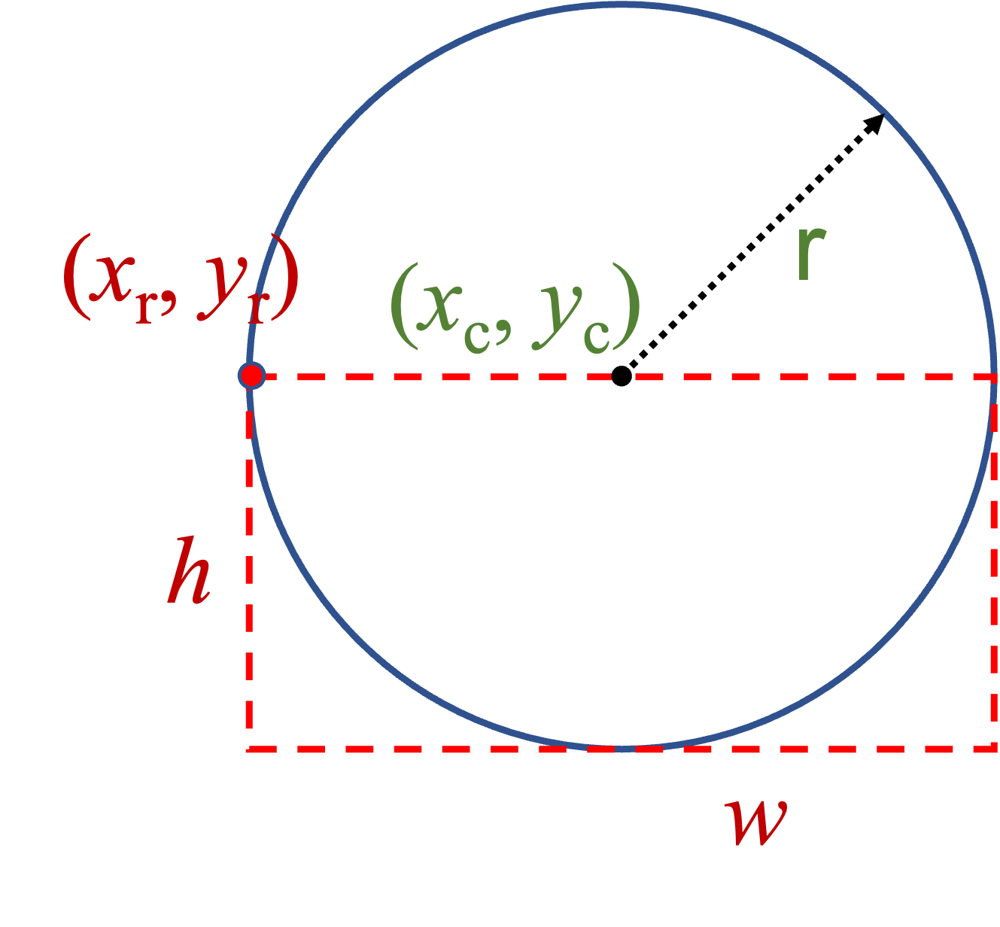

# Exam 1 - Coding Problem

## Point Class

In class, we designed and implemented the Point class.  Included in the Point class are accessor and mutator methods.  We also implemented `distanceTo()` method that calculated and returned the distance between two instances of type Point.

## Circle Class

The Circle class was completed in Recitations 2 and 3.  In Recitation 3, you designed a Circle class that uses Point objects to locate a circle.  In addition, you implemented `contains()`, which determines if an instance of Point is inside the circle, and `intersects()`, which determines if two circles intersect.

## Rectangle Class

The Rectangle class was completed in class as an example of objects that refer to other objects.  The Rectangle class included a `contains()` method that determined if an instance of type Point is in the rectangle and an `intersect()` method that determines if two rectangles intersect.

## Lower-Half Bounding Box of a Circle

A lower-half bounding box of a circle is the **<span style=" color: red;">SMALLEST Rectangle</span>** whose sides are parallel to the x and y axes of the coordinate space and can completely contain the circle.  Figure 1 below shows an instance of Circle of radius *r* that is located at (*x*<sub>c</sub>, *y*<sub>c</sub>) with a lower-half bounding box located at (*x*<sub>r</sub>, *y*<sub>r</sub>) = (*x*<sub>c</sub> - *r*, *y*<sub>c</sub>), width *w* = 2 * *r*, and height *h* = *r*.

<figure style="text-align:center;">

<figcaption style="padding-left:90px;color:#5555bb;">Figure 1: A circle with its lower-half bounding box rectangle</figcaption>
</figure>

## Your Task

Your task is to implement the `getLowerBoundingBox()` method.  The method returns an instance of a Rectangle (Rectangle object) that is the lower-half bounding box of the circle on which it was invoked.  For example,

```java
Circle c = new Circle(new Point(15,10), 10);
Rectangle rect = c.getLowerBoundingBox();
```

The rectangle `rect` should be a Rectangle object located at (5,10) with a width of 20 and a height of 10.

## Test and Submit

A test is provided with the IntelliJ project.  Create a Gradle run configuration and use the test to complete your implementation of `getLowerBoundingBox()`.  When you are ready to submit, use the CodeGrade link to submit your solution.

